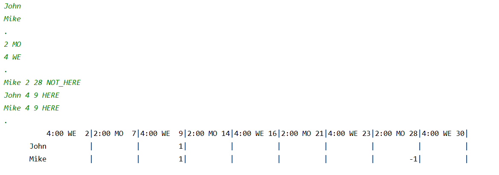

# Day 00 – Piscine Java
### Management structures and arrays

*Takeaways: Today, you will learn the basics of solving both trivial and more challenging business tasks using basic Java language constructs.*

# Contents
1. [Chapter I](#chapter-i) \
	1.1. [Preamble](#preamble)
2. [Chapter II](#chapter-ii) \
	2.1. [General Rules](#general-rules)
3. [Chapter III](#chapter-iii) \
	3.1. [Rules of the Day](#rules-of-the-day)
4. [Chapter IV](#chapter-iv) \
	4.1. [Exercise 00 – Sum of Digits](#exercise-00-sum-of-digits)
5. [Chapter V](#chapter-v) \
	5.1. [Exercise 01 – Really Prime Number](#exercise-01-really-prime-number)
6. [Chapter VI](#chapter-vi) \
	6.1. [Exercise 02 – Endless Sequence (or not?)](#exercise-02-endless-sequence-or-not)
7. [Chapter VII](#chapter-vii) \
	7.1. [Exercise 03 – A Little Bit of Statistics](#exercise-03-a-little-bit-of-statistics)
8. [Chapter VIII](#chapter-viii) \
	8.1. [Exercise 04 – A Bit More of Statistics](#exercise-04-a-bit-more-of-statistics)
9. [Chapter IX](#chapter-ix) \
	9.1. [Exercise 05 – Schedule](#exercise-05-schedule)


# Chapter I 
### Preamble

<br>
Java Man, or *Homo erectus erectus*

# Chapter II
### General Rules
- Use this page as the only reference. Do not listen to any rumors and speculations about how to prepare your solution.
- Now there is only one Java version for you, 1.8. Make sure that compiler and interpreter of this version are installed on your machine.
- You can use IDE to write and debug the source code.
- The code is read more often than written. Read carefully the [document](https://www.oracle.com/technetwork/java/codeconventions-150003.pdf) where code formatting rules are given. When performing each task, make sure you follow the generally accepted [Oracle standards](https://www.oracle.com/java/technologies/javase/codeconventions-namingconventions.html).

- Comments are not allowed in the source code of your solution. They make it difficult to read the code.
- Pay attention to the permissions of your files and directories.
- To be assessed, your solution must be in your GIT repository.
- Your solutions will be evaluated by your piscine mates.
- You should not leave in your "src" directory any other file than those explicitly specified by the exercise instructions. It is recommended that you modify your .gitignore to avoid accidents.
- When you need to get precise output in your programs, it is forbidden to display a precalculated output instead of performing the exercise correctly.
- Have a question? Ask your neighbor on the right. Otherwise, try with your neighbor on the left.
- Your reference manual: mates / Internet / Google. And one more thing. There's an answer to any question you may have on Stackoverflow. Learn how to ask questions correctly.
- Read the examples carefully. They may require things that are not otherwise specified in the subject.
- Use "System.out" for output.
- And may the Force be with you!
- Never leave that till tomorrow which you can do today ;)

# Chapter III
###  Rules of the Day
- User-defined methods and classes are prohibited for all tasks of the day, except for user-defined static functions and procedures in the main class file of the solution.
- All tasks contain a list of ALLOWED language constructs for the specific task.
- System::exit may be used for all tasks.

- All tasks contain an example of how the application operates. The implemented solution must be identical to the specified output example for current input data.
- For illustration purposes, the data entered by the user in task examples are preceded by an arrow (->). Do not take account of these arrows when implementing a solution!

P.S. Some tasks require a non-trivial approach because of the above-mentioned limitations. These limitations will teach you how to find solutions for automating actual business processes.

# Chapter IV
### Exercise 00 – Sum of Digits

|Exercise 00: Sum of Digits||
|------|------|
| Turn-in directory | ex00 |
| Files to turn-in |	Program.java |
| **Allowed** | |
| Input/Output | System.out|
| Types |	Primitive types |
| Operators |	Standard operations of primitive types|

Java is a strictly typed programming language. Fundamental data types (boolean, character, integer, floating point number) are represented in Java by eight primitive types: boolean, char, byte, short, int, long, float, double.

Work with integer type.

Calculate the sum of digits of a six-digit int number (the number value is set directly in the code by explicitly initializating the number variable). 

Example of the program operation for number 479598:
```
$ java Program
  42
```

# Chapter V
### Exercise 01 – Really Prime Number

|Exercise 01: Really Prime Number||
|------|------|
| Turn-in directory |	ex01 |
| Files to turn-in |	Program.java |
| **Allowed** | |
|Input/Output	| System.out, System.err, Scanner(System.in) |
| Types |	Primitive types |
| Operators |	Standard operations of primitive types, conditions, loops |

According to Böhm-Jacopini theorem, any algorithm can be written using three statements: sequence, selection, and iteration.

Using these statements in Java, you need to determine if the input number is a prime. A prime is a number which has no dividers other than the number itself and 1.

The program accepts the number entered from the keyboard as input and displays the result of checking whether that number is a prime.  In addition, the program shall output the number of steps (iterations) required to perform the check. In this task, an iteration is a single comparison operation. 

For negative numbers, 0 and 1, display theIllegalArgument message and shut down the program with the -1 code.

Example of program operation:

```
$ java Program
-> 169
   false 12

$ java Program
-> 113
   true 10

$ java Program
-> 42
   false 1

$ java Program
-> -100 
   Illegal Argument
```

# Chapter VI
### Exercise 02 – Endless Sequence (or not?)

|Exercise 02: Endless Sequence (or not?)||
|------|------|
Turn-in directory |	ex02
Files to turn-in |	Program.java
**Allowed**
Input/Output |	System.out, System.err, Scanner(System.in)
Types |	Primitive types
Operators |	Standard operations of primitive types, conditions, loops

Today, you are Google. 
You need to count queries related to coffee preparation which our search system users make at a certain moment. It is clear that the sequence of search queries is infinite. It is impossible to store these queries and count them later. 

But there is a solution—process the flow of queries. Why should we waste our resources for all queries if we are only interested in a specific feature of this query sequence?  Let's assume that each query is any natural number other than 0 and 1. A query is related to coffee preparation only if the sum of digits of the number (query) is a prime number.

So, we need to implement a program that will count the number of elements for a specified set of numbers whose sum of digits is a prime number.
To keep it simple, let's assume that this potentially infinite sequence of queries is still limited, and the last sequence element is number 42.

This task guarantees that input data is absolutely correct.

Example of program operation:

```
$ java Program
-> 198131
-> 12901212
-> 11122
-> 42
   Count of coffee-request – 2
```

# Chapter VII
### Exercise 03 – A Little Bit of Statistics
Exercise 03: A Little Bit of Statistics ||
---|---
Turn-in directory |	ex03
Files to turn-in |	Program.java
**Allowed**
Input/Output | System.out, System.err, Scanner(System.in)
Types |	Primitive types, String
Operators	| Standard operations of primitive types, conditions, loops
Methods |	String::equals

When developing corporate systems, you often need to collect different kinds of statistics. And the customer always wants such analytics to be illustrative. Who needs cold, dry figures? 

Educational organizations and online schools often belong to this type of customers. Now, you need to implement functionality to visualize students' progress. Customer wants to see a chart showing student's progress changes over several weeks. 

Customer evaluates this progress as a minimal grade for five tests within each week. Each test can be graded between 1 and 9.

The maximum number of weeks for the analysis is 18. Once the program has obtained information for each week, it displays the graph on the console to show minimum grades for a specific week.

And we keep assuming that 42 is the input data limit. 

The exact guaranteed number of tests in a week is 5.

However, the order of weekly data input is not guaranteed, so Week 1's data can be entered after Week 2's data. If data input order is wrong, IllegalArgument message shall be displayed, and the program shall be shut down with -1 code.


**Note**:

1.	There are many options for storing information, and arrays are just one of them. Apply another method for storing data about student tests without the use of arrays.
2.	String concatenation often results in unexpected program behavior. If there are many iterations of a concatenation operation in a cycle for a single variable, an application may slow down significantly. That is why we should not use string concatenation inside a loop to generate a result.

Example of program operation:

```
$ java Program
-> Week 1
-> 4 5 2 4 2
-> Week 2
-> 7 7 7 7 6
-> Week 3
-> 4 3 4 9 8
-> Week 4
-> 9 9 4 6 7
-> 42
Week 1 ==>
Week 2 ======>
Week 3 ===>
Week 4 ====>
```

# Chapter VIII
### Exercise 04 – A Bit More of Statistics
Exercise 04: A Bit More of Statistics ||
---|---
Turn-in directory	| ex04
Files to turn-in |	Program.java
**Allowed**
Input/Output |	System.out, System.err, Scanner(System.in)
Types | Primitive types, String, arrays
Operators	| Standard operations of primitive types, conditions, loops
Methods	| String::equals, String::toCharArray, String::length

Did you know that you can use frequency analysis to decipher poorly encrypted texts?

 See https://en.wikipedia.org/wiki/Frequency_analysis

Feel like a hacker and implement a program for counting a character occurrences in a text. 

We like visual clarity. This is why the program will display the results in a histogram. This chart will show 10 most frequently occurring characters in descending order. 

If letters are encountered the same number of times, they should be sorted in a lexicographic order.

Each character may occur in text a great number of times. For that reason, the chart should be scalable. The maximum height of the displayed chart is 10, and the minimum is 0. 

Input data for the program is a string with a single "\n" character at the end (thus, a single long string can be used as input).

It is assumed that each input character can be contained in a char variable (Unicode BMP; for example, the code of letter "S" is 0053, maximum code value is 65535).

The maximum number of character occurrences is 999.

**Note**: this problem must be solved without multiple iterations over the source text (sorting and removing repetitions), because these methods will significantly slow down the application. Use other information processing methods.

Example of program operation:

```
$ java Program

-> AAAAAAAAAAAAAAAAAAAAAAAAAAAAAAAAASSSSSSSSSSSSSSSSSSSSSSSSDDDDDDDDDDDDDDDDDDDDDDDDDDDDDDDDDWEWWKFKKDKKDSKAKLSLDKSKALLLLLLLLLLRTRTETWTWWWWWWWWWWOOOOOOO42

 36
  #  35
  #   #
  #   #  27
  #   #   #
  #   #   #
  #   #   #
  #   #   #  14  12
  #   #   #   #   #   9
  #   #   #   #   #   #   7   4
  #   #   #   #   #   #   #   #   2   2
  D   A   S   W   L   K   O   T   E   R
```

# Chapter IX
### Exercise 05 – Schedule

Exercise 05: Schedule ||
---|---
Turn-in directory	| ex05
Files to turn-in |Program.java
**Allowed**
Input/Output | System.out, System.err, Scanner(System.in)
Types |	Primitive types, String, arrays
Operators	| Standard operations of primitive types, conditions, loops
Methods |	String::equals, String::toCharArray, String::length

You've just become a great hacker, but your customer comes back to you with another task. This time, they need to be able to maintain a class timetable in their educational institution. Customer opens a school in September 2020. So, you need to implement the MVP version of the project for this month only. 

You need to be able to create a list of students and specify time and weekdays for classes. Classes can be held on any day of week between 1 pm and 6 pm. Multiple classes can be held on a single day. However, total classes per week cannot exceed 10.

Maximum number of students in the timetable is also 10. Maximum length of a student's name is 10 (no spaces).

You should also provide an ability to record student's attendance. To do so, time and date of classes shall be specified next to each student's name along with attendance status (HERE, NOT_HERE). You do not need to record attendance for all classes in a month.

Therefore, application's life cycle is as follows:
1. Creating a list of students
2. Populating a timetable—each class (time, day of week) is entered in a separate row
3. Attendance recording
4. Displaying the timetable in tabular form with attendance statuses.

Each application operation stage is divided by "." (period). Absolute correctness of data is guaranteed, except for sequential ordering of classes when populating the timetable.

Example of program operation:


